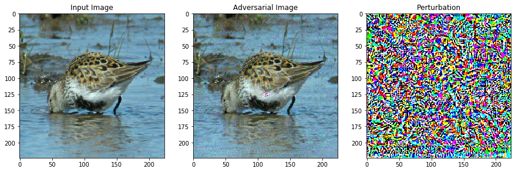

# FA_attack_on_AlexNet
Code of [Adversarial Manipulation of Deep Representations](https://arxiv.org/abs/1511.05122) 
Feature adversaries attack on AlexNet in PyTorch.

## Data
All data are from ImageNet

## Method
As shown in paper, trying to find minimum distance between original image and adversarial example while making adversarial example more like guide image.  



The adversarial image is very similar to input image. But it is classified as 248  (Eskimo dog, husky) which should be 140 (red-backed sandpiper, dunlin, Erolia alpina). I used a image of husky as guide image.

Here is the key function
```
def loss(self, x):   
        #x is the new I
        Ix=Variable(torch.from_numpy(x.reshape(Ig_input.shape)).cuda().float())
        Ix.requires_grad = True
        
        output,feat_x,_,_ = model(Ix)
        loss = torch.dist(feat_x,feat_k_guide,p=2)# minimize \\ q(I）-q(Ig)\\ , feat_k_guide is q(Ig)
        loss.backward(retain_graph=True)
        
        self.loss_value = loss
        self.grad_values = Ix.grad.cpu().numpy().flatten().astype(float)
        
        if(self.iter%200==0):
            pred_result=output.argmax(1, keepdim=True).item()
            print("iter:{},loss：{},predict：{}".format(self.iter,self.loss_value,pred_result))
        self.iter+=1
        return self.loss_value
```

## Blog(Written in Chinese)
[FA Attack](https://blog.andrmapper.cn/2020/08/28/FA-Attack论文复现/)
